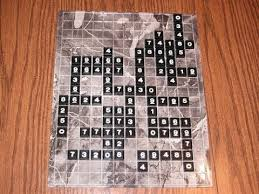

# Quinto Solver

I was on vacation this past month when my uncle revealed he'd brought an old board game, Quinto, he wanted us to play. He proceeded to destroy me in the game by over 100 points. I didn't particularly enjoy getting blown out of the water so I thought I'd write a algorithm to find the best move in any situation and get my revenge.

## Quinto Rules

Quinto is a variation of scrabble using numbers instead of words. Instead of creating words you place sequences of numbers 0-9 that create multiples of 5. No sequence can extend more than 5 tiles. Tiles must be placed in a row. When you place tiles you count every sequence spanning from the tiles you just placed and add that sum to your score. The game ends when all tiles have been placed and someone uses all tiles in their hand. The remaining tiles in other players hands are subtracted from their score. Each player maintains 5 tiles in their hand.

## Solving

The naive approach to find the best placement of tiles for a given board is to check every possible placement of 1-5 tiles from your hand. This is my basic approach. I used a backtracking algorithm that checks all horizontal and veritcal placements and finds the highest scoring move possible.

Since the board of a pretty small size and running through every placement isn't a terribly extensive task. The main slow downs of this algorithm are checking for valid placements and counting score. In the worst case you have to check 25 tiles checking all horizontal and veritcal sequence's sums adding up to 50 iterations. These checks are unavoidable.

## Runtime

Backtracking algorithms are tricky to find the big O runtime of. Since our board is constant and our possible placement count has a ceiling theres is a constant runtime for quinto. If we were to run this algorithm on a M x N size board the runtime is much worse.

The runtime complexity in this case would be O(5^(MN)). Since we have 5 tiles in our hand to chose from and M*N places to put them. This is a high ceiling though because in reality we have far fewer possible locations given a real board.

## Usage

The script can be used by entering your board configuration as the board variable. This makes it easy enter new moves instead of an alternative of entering the board as input to the script. There is another global variable for your hand you can enter in. After filling out the board and your hand, run the script and the best move will be outputed with the tile value and coordinates on the board.

## Improvements

One possible improvement to algorithm would be to include memoization so no smaller sequence will be counted twice. This implementation is tricky to implement and wouldn't provide much of a speed up asymptotically.

We could also prune branches of the search tree. In the case of a 25 x 25 block of tiles no valid placements are possible but the algorithm has to verify each placement is invalid at the moment.
